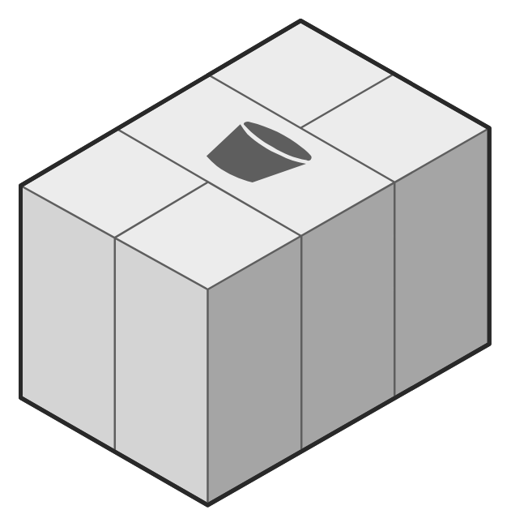

# S3

## Definition

```
{
  _style: { 
    entity: 'verticalLabelPosition=bottom;html=1;verticalAlign=top;strokeWidth=1;align=center;outlineConnect=0;dashed=0;outlineConnect=0;shape=mxgraph.aws3d.s3;fillColor=#ECECEC;strokeColor=#5E5E5E;aspect=fixed;',
  },
  _original_width: 231.5,
  _original_height: 239,
}
```

## Usage

```
import { S3 } from '@dinghy/standard-components-diagrams/aws3d'

<S3/>
```

## Preview


