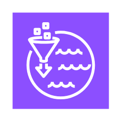

# Aws Analytics Entities

- [Analytics](./analytics.md)  

- [Athena](./athena.md)  

- [AthenaDataSourceConnectors](./athena-data-source-connectors.md)  

- [CleanRooms](./clean-rooms.md)  

- [Cloudsearch](./cloudsearch.md)  

- [CloudsearchSearchDocuments](./cloudsearch-search-documents.md)  

- [Crawler](./crawler.md)  

- [DataExchange](./data-exchange.md)  

- [DataExchangeForApis](./data-exchange-for-apis.md)  

- [DataFirehose](./data-firehose.md)  

- [DataLake](./data-lake.md)  

- [DataPipeline](./data-pipeline.md)  

- [Datazone](./datazone.md)  

- [DatazoneBusinessDataCatalog](./datazone-business-data-catalog.md)  

- [DatazoneDataPortal](./datazone-data-portal.md)  

- [DatazoneDataProjects](./datazone-data-projects.md)  

- [DenseComputeNode](./dense-compute-node.md)  

- [DenseStorageNode](./dense-storage-node.md)  

- [Emr](./emr.md)  

- [EmrEngine](./emr-engine.md)  

- [EmrEngineMaprM3](./emr-engine-mapr-m3.md)  

- [EmrEngineMaprM5](./emr-engine-mapr-m5.md)  

- [EmrEngineMaprM7](./emr-engine-mapr-m7.md)  

- [EntityResolution](./entity-resolution.md)  

- [Finspace](./finspace.md)  

- [Glue](./glue.md)  

- [GlueDataCatalog](./glue-data-catalog.md)  

- [GlueDataQuality](./glue-data-quality.md)  

- [GlueDatabrew](./glue-databrew.md)  

- [GlueDatabrew2](./glue-databrew-2.md)  

- [GlueElasticViews](./glue-elastic-views.md)  

- [GlueForRay](./glue-for-ray.md)  

- [HdfsCluster](./hdfs-cluster.md)  

- [HdfsCluster2](./hdfs-cluster-2.md)  

- [Kinesis](./kinesis.md)  

- [KinesisDataAnalytics](./kinesis-data-analytics.md)  

- [KinesisDataStreams](./kinesis-data-streams.md)  

- [KinesisVideoStreams](./kinesis-video-streams.md)  

- [LakeFormation](./lake-formation.md)  

- [ManagedServiceForApacheFlink](./managed-service-for-apache-flink.md)  

- [ManagedStreamingForApacheKafka](./managed-streaming-for-apache-kafka.md)  

- [MskConnect](./msk-connect.md)  

- [OpensearchService](./opensearch-service.md)  

- [OpensearchServiceClusterAdministratorNode](./opensearch-service-cluster-administrator-node.md)  

- [OpensearchServiceDashboards](./opensearch-service-dashboards.md)  

- [OpensearchServiceDataNode](./opensearch-service-data-node.md)  

- [OpensearchServiceIndex](./opensearch-service-index.md)  

- [OpensearchServiceIngestion](./opensearch-service-ingestion.md)  

- [OpensearchServiceObservability](./opensearch-service-observability.md)  

- [OpensearchServiceTraces](./opensearch-service-traces.md)  

- [OpensearchServiceUltrawarmNode](./opensearch-service-ultrawarm-node.md)  

- [Quicksight](./quicksight.md)  

- [QuicksightPaginatedReports](./quicksight-paginated-reports.md)  

- [Redshift](./redshift.md)  

- [RedshiftAutoCopy](./redshift-auto-copy.md)  

- [RedshiftDataSharingGovernance](./redshift-data-sharing-governance.md)  

- [RedshiftMl](./redshift-ml.md)  

- [RedshiftQueryEditorV20](./redshift-query-editor-v2-0.md)  

- [RedshiftRa3](./redshift-ra3.md)  

- [RedshiftStreamingIngestion](./redshift-streaming-ingestion.md)  

- [Sagemaker](./sagemaker.md)  

- [SqlWorkbench](./sql-workbench.md)  

