# Aws Application Integration Entities

- [ApiGateway](./api-gateway.md)  
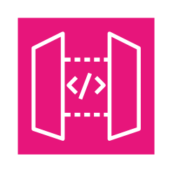

- [ApiGatewayEndpoint](./api-gateway-endpoint.md)  

- [Appflow](./appflow.md)  

- [ApplicationIntegration](./application-integration.md)  

- [Appsync](./appsync.md)  
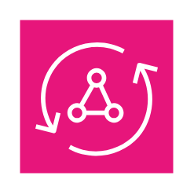

- [B2bDataInterchange](./b2b-data-interchange.md)  
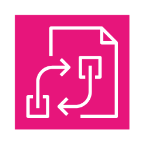

- [ConsoleMobileApplication](./console-mobile-application.md)  

- [CustomEventBus](./custom-event-bus.md)  

- [DefaultEventBus](./default-event-bus.md)  
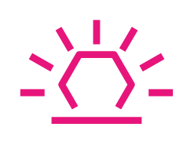

- [EmailNotification](./email-notification.md)  

- [Event](./event.md)  

- [EventResource](./event-resource.md)  

- [Eventbridge](./eventbridge.md)  

- [EventbridgePipes](./eventbridge-pipes.md)  
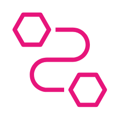

- [EventbridgeScheduler](./eventbridge-scheduler.md)  

- [EventbridgeSchema](./eventbridge-schema.md)  

- [EventbridgeSchemaRegistry](./eventbridge-schema-registry.md)  
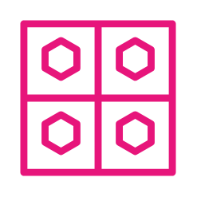

- [ExpressWorkflows](./express-workflows.md)  

- [HttpNotification](./http-notification.md)  

- [ManagedWorkflowsForApacheAirflow](./managed-workflows-for-apache-airflow.md)  

- [Message](./message.md)  
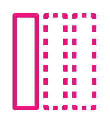

- [Mq](./mq.md)  

- [MqBroker](./mq-broker.md)  
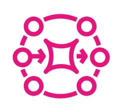

- [Queue](./queue.md)  

- [Rule](./rule.md)  
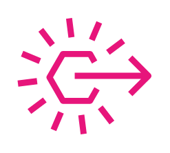

- [SaasPartnerEvent](./saas-partner-event.md)  
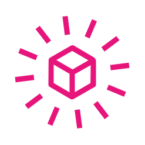

- [SimpleNotificationService](./simple-notification-service.md)  

- [SimpleQueueService](./simple-queue-service.md)  
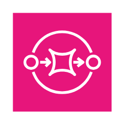

- [StepFunctions](./step-functions.md)  

- [Topic](./topic.md)  

