# Aws Compute Entities

- [LightsailForResearch](./lightsail-for-research.md)  

- [A1Instance](./a1-instance.md)  
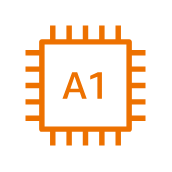

- [AmiResource](./ami-resource.md)  

- [AppRunner](./app-runner.md)  

- [AutoScaling](./auto-scaling.md)  

- [AutoScaling2](./auto-scaling-2.md)  

- [Batch](./batch.md)  

- [Bottlerocket](./bottlerocket.md)  

- [C4Instance](./c4-instance.md)  
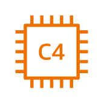

- [C5Instance](./c5-instance.md)  
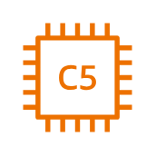

- [C5aInstance](./c5a-instance.md)  
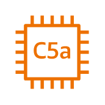

- [C5adInstance](./c5ad-instance.md)  
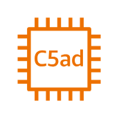

- [C5dInstance](./c5d-instance.md)  
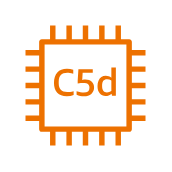

- [C5nInstance](./c5n-instance.md)  
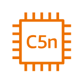

- [C6aInstance](./c6a-instance.md)  
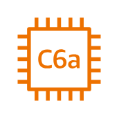

- [C6gInstance](./c6g-instance.md)  
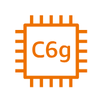

- [C6gdInstance](./c6gd-instance.md)  

- [C6gnInstance](./c6gn-instance.md)  

- [C6iInstance](./c6i-instance.md)  

- [C6inInstance](./c6in-instance.md)  
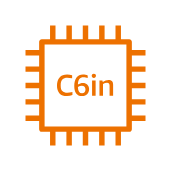

- [C7gInstance](./c7g-instance.md)  
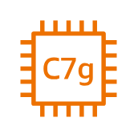

- [C7gnInstance](./c7gn-instance.md)  
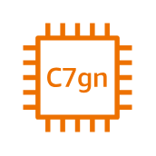

- [Compute](./compute.md)  
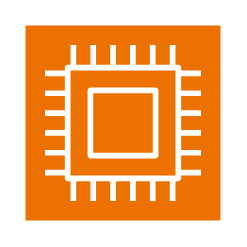

- [ComputeOptimizer](./compute-optimizer.md)  

- [D2Instance](./d2-instance.md)  
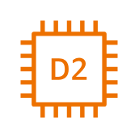

- [D3Instance](./d3-instance.md)  
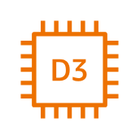

- [D3enInstance](./d3en-instance.md)  
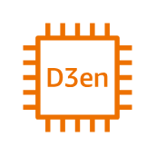

- [DbInstance](./db-instance.md)  

- [Dcv](./dcv.md)  

- [Deployment](./deployment.md)  

- [Dl1Instance](./dl1-instance.md)  
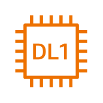

- [Ec2](./ec2.md)  

- [Ec2AutoScaling](./ec2-auto-scaling.md)  

- [Ec2AwsMicroserviceExtractorForNet](./ec2-aws-microservice-extractor-for-net.md)  

- [Ec2ImageBuilder](./ec2-image-builder.md)  

- [Ec2M1MacInstance](./ec2-m1-mac-instance.md)  
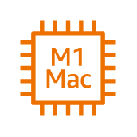

- [ElasticBeanstalk](./elastic-beanstalk.md)  

- [ElasticBeanstalkApplication](./elastic-beanstalk-application.md)  

- [ElasticFabricAdapter](./elastic-fabric-adapter.md)  

- [ElasticIpAddress](./elastic-ip-address.md)  

- [ElasticLoadBalancing](./elastic-load-balancing.md)  

- [F1Instance](./f1-instance.md)  
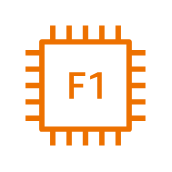

- [Fargate](./fargate.md)  

- [G3Instance](./g3-instance.md)  
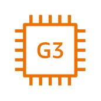

- [G4adInstance](./g4ad-instance.md)  
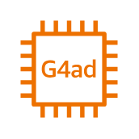

- [G4dnInstance](./g4dn-instance.md)  
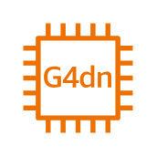

- [G5Instance](./g5-instance.md)  

- [G5gInstance](./g5g-instance.md)  

- [GenomicsCli](./genomics-cli.md)  

- [H1Instance](./h1-instance.md)  
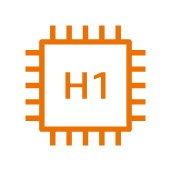

- [HabanaGaudiInstance](./habana-gaudi-instance.md)  

- [HighMemoryInstance](./high-memory-instance.md)  

- [Hpc6aInstance](./hpc6a-instance.md)  
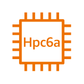

- [Hpc6idInstance](./hpc6id-instance.md)  

- [I2Instance](./i2-instance.md)  
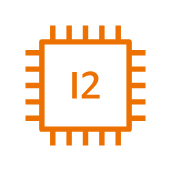

- [I3Instance](./i3-instance.md)  
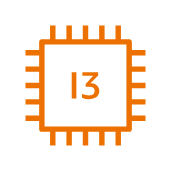

- [I3enInstance](./i3en-instance.md)  
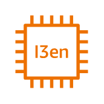

- [I4iInstance](./i4i-instance.md)  
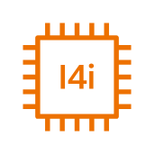

- [Im4gnInstance](./im4gn-instance.md)  
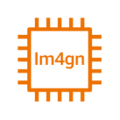

- [Inf1](./inf1.md)  

- [Inf2](./inf2.md)  
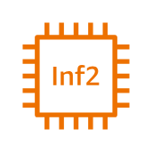

- [Inferentia](./inferentia.md)  
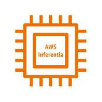

- [Instance](./instance.md)  
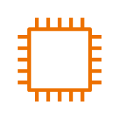

- [InstanceWithCloudwatch](./instance-with-cloudwatch.md)  

- [Instances](./instances.md)  

- [Is4genInstance](./is4gen-instance.md)  
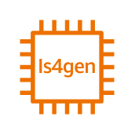

- [Lambda](./lambda.md)  

- [LambdaFunction](./lambda-function.md)  

- [Lightsail](./lightsail.md)  

- [LocalZones](./local-zones.md)  

- [M4Instance](./m4-instance.md)  

- [M5Instance](./m5-instance.md)  
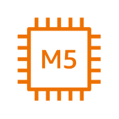

- [M5aInstance](./m5a-instance.md)  

- [M5dInstance](./m5d-instance.md)  
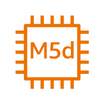

- [M5dnInstance](./m5dn-instance.md)  
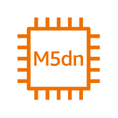

- [M5nInstance](./m5n-instance.md)  
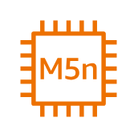

- [M5znInstance](./m5zn-instance.md)  
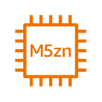

- [M6aInstance](./m6a-instance.md)  

- [M6gInstance](./m6g-instance.md)  
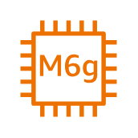

- [M6gdInstance](./m6gd-instance.md)  

- [M6iInstance](./m6i-instance.md)  
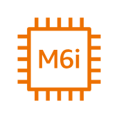

- [M6idnInstance](./m6idn-instance.md)  
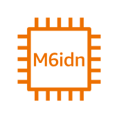

- [M6inInstance](./m6in-instance.md)  
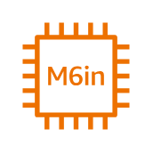

- [MacInstance](./mac-instance.md)  

- [NiceEnginframe](./nice-enginframe.md)  

- [NitroEnclaves](./nitro-enclaves.md)  
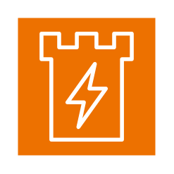

- [OptimizedInstance](./optimized-instance.md)  

- [OutpostsFamily](./outposts-family.md)  

- [OutpostsRack](./outposts-rack.md)  

- [OutpostsServers](./outposts-servers.md)  

- [P2Instance](./p2-instance.md)  
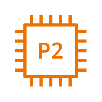

- [P3Instance](./p3-instance.md)  
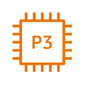

- [P3dnInstance](./p3dn-instance.md)  

- [P4Instance](./p4-instance.md)  

- [P4dInstance](./p4d-instance.md)  

- [P4deInstance](./p4de-instance.md)  

- [ParallelCluster](./parallel-cluster.md)  

- [ParallelComputingService](./parallel-computing-service.md)  

- [R4Instance](./r4-instance.md)  
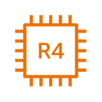

- [R5Instance](./r5-instance.md)  
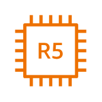

- [R5aInstance](./r5a-instance.md)  
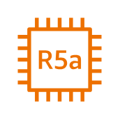

- [R5adInstance](./r5ad-instance.md)  
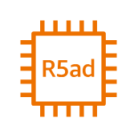

- [R5bInstance](./r5b-instance.md)  
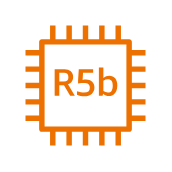

- [R5dInstance](./r5d-instance.md)  

- [R5gdInstance](./r5gd-instance.md)  

- [R5nInstance](./r5n-instance.md)  

- [R6aInstance](./r6a-instance.md)  

- [R6gInstance](./r6g-instance.md)  

- [R6iInstance](./r6i-instance.md)  

- [R6idnInstance](./r6idn-instance.md)  

- [R6inInstance](./r6in-instance.md)  

- [R7izInstance](./r7iz-instance.md)  

- [RdnInstance](./rdn-instance.md)  

- [Rescue](./rescue.md)  

- [ServerlessApplicationRepository](./serverless-application-repository.md)  

- [SimspaceWeaver](./simspace-weaver.md)  

- [SpotInstance](./spot-instance.md)  

- [T2Instance](./t2-instance.md)  

- [T3Instance](./t3-instance.md)  

- [T3aInstance](./t3a-instance.md)  

- [T4gInstance](./t4g-instance.md)  

- [TrainiumInstance](./trainium-instance.md)  

- [Trn1Instance](./trn1-instance.md)  

- [VmwareCloudOnAws](./vmware-cloud-on-aws.md)  

- [Vt1Instance](./vt1-instance.md)  

- [Wavelength](./wavelength.md)  

- [X1Instance](./x1-instance.md)  

- [X1eInstance](./x1e-instance.md)  

- [X2gdInstance](./x2gd-instance.md)  

- [X2idnInstance](./x2idn-instance.md)  

- [X2iednInstance](./x2iedn-instance.md)  

- [X2ieznInstance](./x2iezn-instance.md)  

- [Z1dInstance](./z1d-instance.md)  

