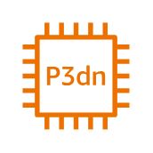

# P3dn Instance

## Definition

```
{
  _style: { 
    entity: 'sketch=0;outlineConnect=0;fontColor=#232F3E;gradientColor=none;fillColor=#ED7100;strokeColor=none;dashed=0;verticalLabelPosition=bottom;verticalAlign=top;align=center;html=1;fontSize=12;fontStyle=0;aspect=fixed;pointerEvents=1;shape=mxgraph.aws4.p3dn_instance;',
  },
  _original_width: 48,
  _original_height: 48,
}
```

## Usage

```
import { P3dnInstance } from '@diac/standard-components-diagrams/awsCompute'

<P3dnInstance/>
```

## Preview


