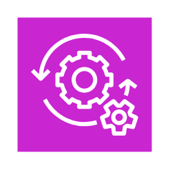

# Aws Customer Enablement Entities

- [Activate](./activate.md)  

- [CustomerEnablement](./customer-enablement.md)  

- [Iq](./iq.md)  

- [ManagedServices](./managed-services.md)  

- [ProfessionalServices](./professional-services.md)  

- [Repost](./repost.md)  

- [RepostPrivate](./repost-private.md)  

- [Support](./support.md)  

- [TrainingCertification](./training-certification.md)  

