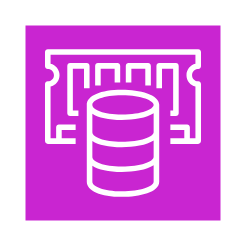
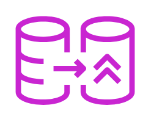

# Aws Database Entities

- [Attribute](./attribute.md)  

- [Attributes](./attributes.md)  

- [Aurora](./aurora.md)  

- [AuroraInstance](./aurora-instance.md)  

- [AuroraInstance2](./aurora-instance-2.md)  

- [CacheNode](./cache-node.md)  

- [Database](./database.md)  

- [DatabaseMigrationService](./database-migration-service.md)  

- [DatabaseMigrationWorkflowJob](./database-migration-workflow-job.md)  

- [DenseComputeNode](./dense-compute-node.md)  

- [DenseStorageNode](./dense-storage-node.md)  

- [Documentdb](./documentdb.md)  

- [DocumentdbElasticClusters](./documentdb-elastic-clusters.md)  

- [Dynamodb](./dynamodb.md)  

- [DynamodbAccelerator](./dynamodb-accelerator.md)  

- [DynamodbStandardAccessTableClass](./dynamodb-standard-access-table-class.md)  

- [DynamodbStandardInfrequentAccessTableClass](./dynamodb-standard-infrequent-access-table-class.md)  

- [DynamodbStream](./dynamodb-stream.md)  

- [Elasticache](./elasticache.md)  

- [ElasticacheForMemcached](./elasticache-for-memcached.md)  

- [ElasticacheForRedis](./elasticache-for-redis.md)  

- [ElasticacheForValkey](./elasticache-for-valkey.md)  

- [GlobalSecondaryIndex](./global-secondary-index.md)  

- [Item](./item.md)  

- [Items](./items.md)  

- [Keyspaces](./keyspaces.md)  

- [ManagedApacheCassandraService](./managed-apache-cassandra-service.md)  

- [MariadbInstance](./mariadb-instance.md)  

- [MariadbInstance2](./mariadb-instance-2.md)  

- [Memorydb](./memorydb.md)  

- [MysqlInstance](./mysql-instance.md)  

- [MysqlInstance2](./mysql-instance-2.md)  

- [Neptune](./neptune.md)  

- [OracleDatabaseAtAws](./oracle-database-at-aws.md)  

- [OracleInstance](./oracle-instance.md)  

- [OracleInstance2](./oracle-instance-2.md)  

- [PiopsInstance](./piops-instance.md)  

- [PostgreSqlInstance](./postgre-sql-instance.md)  

- [PostgreSqlInstance2](./postgre-sql-instance-2.md)  

- [QuantumLedgerDatabase](./quantum-ledger-database.md)  

- [Rds](./rds.md)  

- [RdsBlueGreenDeployments](./rds-blue-green-deployments.md)  

- [RdsInstance](./rds-instance.md)  

- [RdsInstance2](./rds-instance-2.md)  

- [RdsMultiAz](./rds-multi-az.md)  

- [RdsMultiAzDbCluster](./rds-multi-az-db-cluster.md)  

- [RdsOnVmware](./rds-on-vmware.md)  

- [RdsOptimizedWrites](./rds-optimized-writes.md)  

- [RdsProxyInstance](./rds-proxy-instance.md)  

- [RdsProxyInstance2](./rds-proxy-instance-2.md)  

- [Redshift](./redshift.md)  

- [SqlServerInstance](./sql-server-instance.md)  

- [SqlServerInstance2](./sql-server-instance-2.md)  

- [Table](./table.md)  

- [Timestream](./timestream.md)  

- [TrustedLanguageExtensionsForPostgresql](./trusted-language-extensions-for-postgresql.md)  

