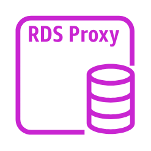

# RDS Proxy Instance

## Definition

```
{
  _style: 'sketch=0;outlineConnect=0;fontColor=#232F3E;gradientColor=none;fillColor=#C925D1;strokeColor=none;dashed=0;verticalLabelPosition=bottom;verticalAlign=top;align=center;html=1;fontSize=12;fontStyle=0;aspect=fixed;pointerEvents=1;shape=mxgraph.aws4.rds_proxy;',
  _width: 60,
  _height: 60,
}
```

## Usage

```
import { RdsProxyInstance } from '@diac/standard-components-diagrams/awsDatabase'

<RdsProxyInstance/>
```

## Preview


