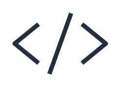

# Programming Language

## Definition

```
{
  _style: { 
    entity: 'sketch=0;outlineConnect=0;fontColor=#232F3E;gradientColor=none;fillColor=#232F3D;strokeColor=none;dashed=0;verticalLabelPosition=bottom;verticalAlign=top;align=center;html=1;fontSize=12;fontStyle=0;aspect=fixed;pointerEvents=1;shape=mxgraph.aws4.programming_language;',
  },
  _original_width: 78,
  _original_height: 51,
}
```

## Usage

```
import { ProgrammingLanguage } from '@dinghy/standard-components-diagrams/awsGeneralResources'

<ProgrammingLanguage/>
```

## Preview


