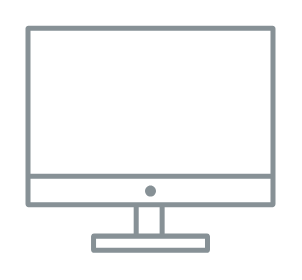

# desktop

## Definition

```
{
  _style: { 
    entity: 'sketch=0;outlineConnect=0;gradientColor=none;fontColor=#545B64;strokeColor=none;fillColor=#879196;dashed=0;verticalLabelPosition=bottom;verticalAlign=top;align=center;html=1;fontSize=12;fontStyle=0;aspect=fixed;shape=mxgraph.aws4.illustration_desktop;pointerEvents=1',
  },
  _original_width: 100,
  _original_height: 91,
}
```

## Usage

```
import { Desktop } from '@diac/standard-components-diagrams/awsIllustrations'

<Desktop/>
```

## Preview


