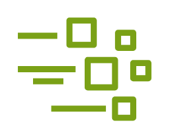

# Greengrass Stream Manager

## Definition

```
{
  _style: { 
    entity: 'sketch=0;outlineConnect=0;fontColor=#232F3E;gradientColor=none;fillColor=#7AA116;strokeColor=none;dashed=0;verticalLabelPosition=bottom;verticalAlign=top;align=center;html=1;fontSize=12;fontStyle=0;aspect=fixed;pointerEvents=1;shape=mxgraph.aws4.iot_greengrass_stream_manager;',
  },
  _width: 78,
  _height: 60,
}
```

## Usage

```
import { GreengrassStreamManager } from '@diac/standard-components-diagrams/awsInternetOfThings'

<GreengrassStreamManager/>
```

## Preview


