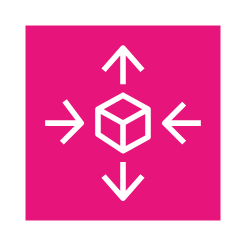
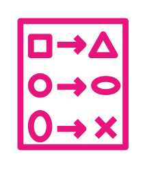
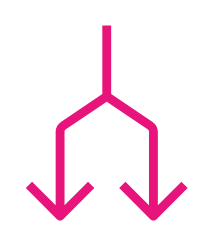
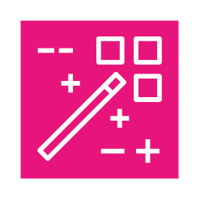
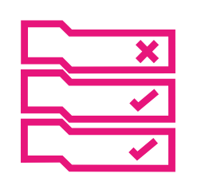

# Aws Management &amp; Governance Entities

- [Account](./account.md)  

- [Alarm](./alarm.md)  

- [AppConfig](./app-config.md)  

- [ApplicationAutoScaling](./application-auto-scaling.md)  

- [ApplicationManager](./application-manager.md)  

- [Apps](./apps.md)  

- [AutoScaling](./auto-scaling.md)  

- [Automation](./automation.md)  

- [BackintAgent](./backint-agent.md)  

- [ChangeCalendar](./change-calendar.md)  

- [ChangeManager](./change-manager.md)  

- [ChangeSet](./change-set.md)  

- [Chatbot](./chatbot.md)  

- [Checklist](./checklist.md)  

- [ChecklistCost](./checklist-cost.md)  

- [ChecklistFaultTolerant](./checklist-fault-tolerant.md)  

- [ChecklistPerformance](./checklist-performance.md)  

- [ChecklistSecurity](./checklist-security.md)  

- [Cloudformation](./cloudformation.md)  

- [Cloudtrail](./cloudtrail.md)  

- [CloudtrailLake](./cloudtrail-lake.md)  

- [Cloudwatch](./cloudwatch.md)  

- [CloudwatchCrossAccountObservability](./cloudwatch-cross-account-observability.md)  

- [CloudwatchDataProtection](./cloudwatch-data-protection.md)  

- [CloudwatchEvidently](./cloudwatch-evidently.md)  

- [CloudwatchLogs](./cloudwatch-logs.md)  

- [CloudwatchMetricsInsights](./cloudwatch-metrics-insights.md)  

- [CloudwatchRum](./cloudwatch-rum.md)  

- [CloudwatchSynthetics](./cloudwatch-synthetics.md)  

- [Codeguru](./codeguru.md)  

- [CommandLineInterface](./command-line-interface.md)  

- [Compliance](./compliance.md)  

- [ComputeOptimizer](./compute-optimizer.md)  

- [Config](./config.md)  

- [ConsoleMobileApplication](./console-mobile-application.md)  

- [ControlTower](./control-tower.md)  

- [Deployments](./deployments.md)  

- [Distributor](./distributor.md)  

- [DistroForOpentelemetry](./distro-for-opentelemetry.md)  

- [Documents](./documents.md)  

- [EventEventBased](./event-event-based.md)  

- [EventTimeBased](./event-time-based.md)  

- [FaultInjectionSimulator](./fault-injection-simulator.md)  

- [HealthDashboard](./health-dashboard.md)  

- [IncidentManager](./incident-manager.md)  

- [Instances](./instances.md)  

- [Inventory](./inventory.md)  

- [LaunchWizard](./launch-wizard.md)  

- [Layers](./layers.md)  

- [LicenseManager](./license-manager.md)  

- [LicenseManagerApplicationDiscovery](./license-manager-application-discovery.md)  

- [LicenseManagerLicenseBlending](./license-manager-license-blending.md)  

- [Logs](./logs.md)  

- [MaintenanceWindows](./maintenance-windows.md)  

- [ManagedGrafana](./managed-grafana.md)  

- [ManagedServiceForPrometheus](./managed-service-for-prometheus.md)  

- [ManagedServices](./managed-services.md)  

- [ManagementGovernance](./management-governance.md)  

- [ManagementConsole](./management-console.md)  

- [Monitoring](./monitoring.md)  

- [Opscenter](./opscenter.md)  

- [Opsworks](./opsworks.md)  

- [OrganizationalUnit](./organizational-unit.md)  

- [Organizations](./organizations.md)  

- [OrganizationsAccount](./organizations-account.md)  

- [OrganizationsManagementAccount](./organizations-management-account.md)  

- [OrganizationsManagementAccount2](./organizations-management-account-2.md)  

- [ParameterStore](./parameter-store.md)  

- [PatchManager](./patch-manager.md)  

- [Permissions](./permissions.md)  

- [Proton](./proton.md)  

- [ResilienceHub](./resilience-hub.md)  

- [ResourceExplorer](./resource-explorer.md)  

- [Resources](./resources.md)  

- [Rule](./rule.md)  

- [RunCommand](./run-command.md)  

- [ServiceCatalog](./service-catalog.md)  

- [ServiceManagementConnector](./service-management-connector.md)  

- [SessionManager](./session-manager.md)  

- [ShieldAdvanced](./shield-advanced.md)  

- [Stack](./stack.md)  

- [Stack2](./stack-2.md)  

- [StateManager](./state-manager.md)  

- [SystemsManager](./systems-manager.md)  

- [SystemsManagerIncidentManager](./systems-manager-incident-manager.md)  

- [TelcoNetworkBuilder](./telco-network-builder.md)  

- [Template](./template.md)  

- [TrustedAdvisor](./trusted-advisor.md)  

- [UserNotifications](./user-notifications.md)  

- [WellArchitectedTool](./well-architected-tool.md)  

