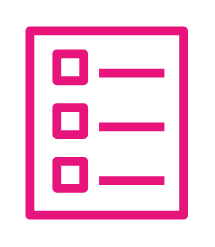

# Template

## Definition

```
{
  _style: { 
    entity: 'sketch=0;outlineConnect=0;fontColor=#232F3E;gradientColor=none;fillColor=#E7157B;strokeColor=none;dashed=0;verticalLabelPosition=bottom;verticalAlign=top;align=center;html=1;fontSize=12;fontStyle=0;aspect=fixed;pointerEvents=1;shape=mxgraph.aws4.template;',
  },
  _original_width: 65,
  _original_height: 78,
}
```

## Usage

```
import { Template } from '@diac/standard-components-diagrams/awsManagementGovernance'

<Template/>
```

## Preview


