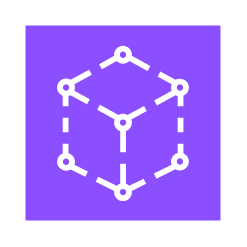
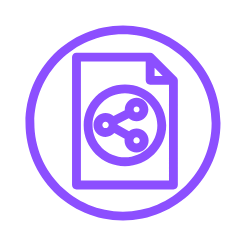
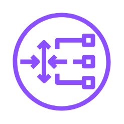
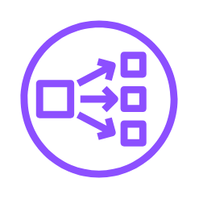
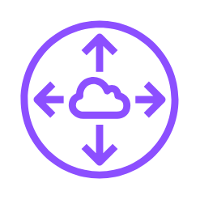
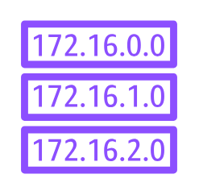
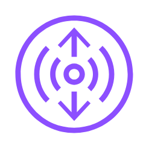
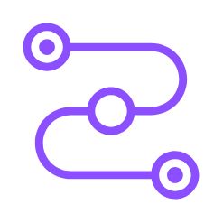

# Aws Network &amp; Content Delivery Entities

- [ApiGateway](./api-gateway.md)  

- [AppMesh](./app-mesh.md)  

- [ApplicationLoadBalancer](./application-load-balancer.md)  

- [ApplicationRecoveryController](./application-recovery-controller.md)  

- [ClassicLoadBalancer](./classic-load-balancer.md)  

- [ClientVpn](./client-vpn.md)  

- [CloudDirectory](./cloud-directory.md)  

- [CloudMap](./cloud-map.md)  

- [CloudWan](./cloud-wan.md)  

- [CloudWanCoreNetworkEdge](./cloud-wan-core-network-edge.md)  

- [CloudWanSegmentNetwork](./cloud-wan-segment-network.md)  

- [CloudWanTransitGatewayRouteTableAttachment](./cloud-wan-transit-gateway-route-table-attachment.md)  

- [Cloudfront](./cloudfront.md)  

- [CloudfrontFunctions](./cloudfront-functions.md)  

- [DirectConnect](./direct-connect.md)  

- [DownloadDistribution](./download-distribution.md)  

- [EdgeLocation](./edge-location.md)  

- [ElasticLoadBalancing](./elastic-load-balancing.md)  

- [ElasticNetworkAdapter](./elastic-network-adapter.md)  

- [ElasticNetworkInterface](./elastic-network-interface.md)  

- [Endpoint](./endpoint.md)  

- [Endpoints](./endpoints.md)  

- [FlowLogs](./flow-logs.md)  

- [Gateway](./gateway.md)  

- [GatewayLoadBalancer](./gateway-load-balancer.md)  

- [GlobalAccelerator](./global-accelerator.md)  

- [HostedZone](./hosted-zone.md)  

- [InternetGateway](./internet-gateway.md)  

- [Mesh](./mesh.md)  

- [Namespace](./namespace.md)  

- [NatGateway](./nat-gateway.md)  

- [NetworkAccessControlList](./network-access-control-list.md)  

- [NetworkLoadBalancer](./network-load-balancer.md)  

- [NetworkingAndContentDelivery](./networking-and-content-delivery.md)  

- [PeeringConnection](./peering-connection.md)  

- [Private5g](./private-5g.md)  

- [Privatelink](./privatelink.md)  

- [Resource](./resource.md)  

- [Route53](./route-53.md)  

- [Route53ApplicationRecoveryController](./route-53-application-recovery-controller.md)  

- [Route53ReadinessChecks](./route-53-readiness-checks.md)  

- [Route53Resolver](./route-53-resolver.md)  

- [Route53ResolverDnsFirewall](./route-53-resolver-dns-firewall.md)  

- [Route53ResolverQueryLogging](./route-53-resolver-query-logging.md)  

- [Route53RoutingControls](./route-53-routing-controls.md)  

- [RouteTable](./route-table.md)  

- [Router](./router.md)  

- [Service](./service.md)  

- [SiteToSiteVpn](./site-to-site-vpn.md)  

- [StreamingDistribution](./streaming-distribution.md)  

- [TrafficMirroring](./traffic-mirroring.md)  

- [TransitGateway](./transit-gateway.md)  

- [TransitGatewayAttachment](./transit-gateway-attachment.md)  

- [VerifiedAccess](./verified-access.md)  

- [VirtualGateway](./virtual-gateway.md)  

- [VirtualNode](./virtual-node.md)  

- [VirtualRouter](./virtual-router.md)  

- [VirtualService](./virtual-service.md)  

- [Vpc](./vpc.md)  

- [Vpc2](./vpc-2.md)  

- [VpcCarrierGateway](./vpc-carrier-gateway.md)  

- [VpcCustomerGateway](./vpc-customer-gateway.md)  

- [VpcLattice](./vpc-lattice.md)  

- [VpcNetworkAccessAnalyzer](./vpc-network-access-analyzer.md)  

- [VpcReachabilityAnalyzer](./vpc-reachability-analyzer.md)  

- [VpnConnection](./vpn-connection.md)  

- [VpnGateway](./vpn-gateway.md)  

