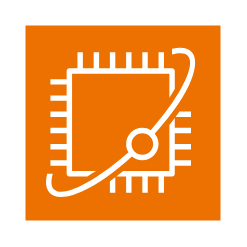
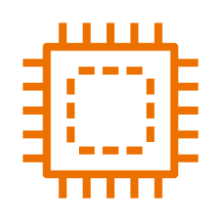
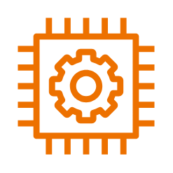
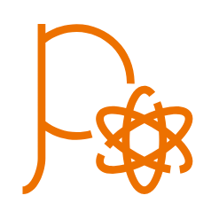
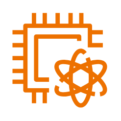
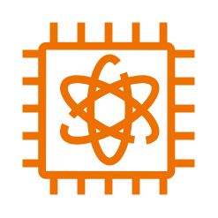
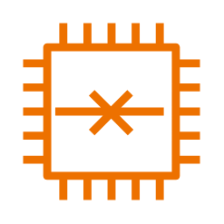

# Aws Quantum Technologies Entities

- [Braket](./braket.md)  

- [BraketChandelier](./braket-chandelier.md)  

- [BraketChip](./braket-chip.md)  

- [BraketEmbeddedSimulator](./braket-embedded-simulator.md)  

- [BraketManagedSimulator](./braket-managed-simulator.md)  

- [BraketNoiseSimulator](./braket-noise-simulator.md)  

- [BraketQpu](./braket-qpu.md)  

- [BraketSimulator](./braket-simulator.md)  

- [BraketSimulator2](./braket-simulator-2.md)  

- [BraketSimulator3](./braket-simulator-3.md)  

- [BraketSimulator4](./braket-simulator-4.md)  

- [BraketSimulator5](./braket-simulator-5.md)  

- [BraketStateVector](./braket-state-vector.md)  

- [BraketTensorNetwork](./braket-tensor-network.md)  

- [QuantumTechnologies](./quantum-technologies.md)  

