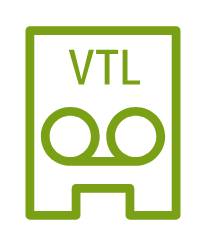

# Virtual Tape Library

## Definition

```
{
  _style: { 
    entity: 'sketch=0;outlineConnect=0;fontColor=#232F3E;gradientColor=none;fillColor=#7AA116;strokeColor=none;dashed=0;verticalLabelPosition=bottom;verticalAlign=top;align=center;html=1;fontSize=12;fontStyle=0;aspect=fixed;pointerEvents=1;shape=mxgraph.aws4.virtual_tape_library;',
  },
  _original_width: 62,
  _original_height: 78,
}
```

## Usage

```
import { VirtualTapeLibrary } from '@dinghy/standard-components-diagrams/awsStorage'

<VirtualTapeLibrary/>
```

## Preview


