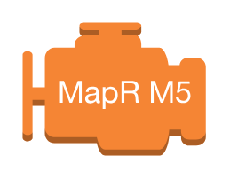

# Aws17 Analytics Entities

- [Athena](./athena.md)  

- [Cloudsearch](./cloudsearch.md)  

- [Cluster](./cluster.md)  

- [DataPipeline](./data-pipeline.md)  

- [DenseComputeNode](./dense-compute-node.md)  

- [DenseStorageNode](./dense-storage-node.md)  

- [ElasticsearchService](./elasticsearch-service.md)  

- [Emr](./emr.md)  

- [EmrEngine](./emr-engine.md)  

- [EmrEngineMaprM3](./emr-engine-mapr-m3.md)  

- [EmrEngineMaprM5](./emr-engine-mapr-m5.md)  

- [EmrEngineMaprM7](./emr-engine-mapr-m7.md)  

- [Glue](./glue.md)  

- [HdfsCluster](./hdfs-cluster.md)  

- [Kinesis](./kinesis.md)  

- [KinesisAnalytics](./kinesis-analytics.md)  

- [KinesisFirehose](./kinesis-firehose.md)  

- [KinesisStreams](./kinesis-streams.md)  

- [KinesisEnabledApp](./kinesis-enabled-app.md)  

- [Quicksight](./quicksight.md)  

- [Redshift](./redshift.md)  

- [SearchDocuments](./search-documents.md)  

