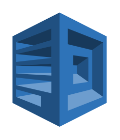

# Polly

## Definition

```
{
  _style: 'outlineConnect=0;dashed=0;verticalLabelPosition=bottom;verticalAlign=top;align=center;html=1;shape=mxgraph.aws3.polly;fillColor=#2E73B8;gradientColor=none;',
  _width: 76.5,
  _height: 93,
}
```

## Usage

```
import { Polly } from '@reactiac/standard-components-diagrams/aws17ArtificialIntelligence'

<Polly/>
```

## Preview


