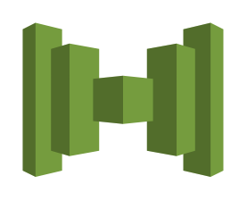

# Connect

## Definition

```
{
  _style: { 
    entity: 'outlineConnect=0;dashed=0;verticalLabelPosition=bottom;verticalAlign=top;align=center;html=1;shape=mxgraph.aws3.connect;fillColor=#759C3E;gradientColor=none;',
  },
  _width: 90,
  _height: 69,
}
```

## Usage

```
import { Connect } from '@diac/standard-components-diagrams/aws17ContactCenter'

<Connect/>
```

## Preview


