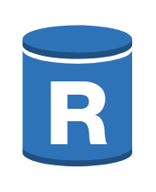

# RDS DB Instance Read Replica

## Definition

```
{
  _style: { 
    entity: 'outlineConnect=0;dashed=0;verticalLabelPosition=bottom;verticalAlign=top;align=center;html=1;shape=mxgraph.aws3.rds_db_instance_read_replica;fillColor=#2E73B8;gradientColor=none;',
  },
  _original_width: 49.5,
  _original_height: 66,
}
```

## Usage

```
import { RdsDbInstanceReadReplica } from '@diac/standard-components-diagrams/aws17Database'

<RdsDbInstanceReadReplica/>
```

## Preview


