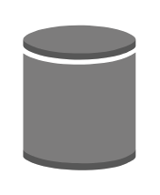

# Generic Database

## Definition

```
{
  _style: 'outlineConnect=0;dashed=0;verticalLabelPosition=bottom;verticalAlign=top;align=center;html=1;shape=mxgraph.aws3.generic_database;fillColor=#7D7C7C;gradientColor=none;',
  _width: 49.5,
  _height: 64.5,
}
```

## Usage

```
import { GenericDatabase } from '@reactiac/standard-components-diagrams/aws17General'

<GenericDatabase/>
```

## Preview


