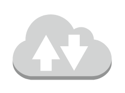

# Internet 2

## Definition

```
{
  _style: { 
    entity: 'outlineConnect=0;dashed=0;verticalLabelPosition=bottom;verticalAlign=top;align=center;html=1;shape=mxgraph.aws3.internet_2;fillColor=#D2D3D3;gradientColor=none;',
  },
  _original_width: 79.5,
  _original_height: 54,
}
```

## Usage

```
import { Internet2 } from '@dinghy/standard-components-diagrams/aws17General'

<Internet2/>
```

## Preview


