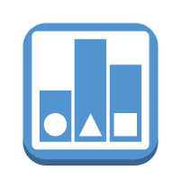

# Desired State

## Definition

```
{
  _style: { 
    entity: 'outlineConnect=0;dashed=0;verticalLabelPosition=bottom;verticalAlign=top;align=center;html=1;shape=mxgraph.aws3.desired_state;fillColor=#5294CF;gradientColor=none;',
  },
  _original_width: 60,
  _original_height: 63,
}
```

## Usage

```
import { DesiredState } from '@dinghy/standard-components-diagrams/aws17InternetOfThings'

<DesiredState/>
```

## Preview


