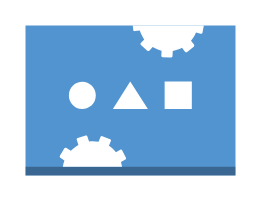

# Servo

## Definition

```
{
  _style: 'outlineConnect=0;dashed=0;verticalLabelPosition=bottom;verticalAlign=top;align=center;html=1;shape=mxgraph.aws3.servo;fillColor=#5294CF;gradientColor=none;',
  _width: 84,
  _height: 60,
}
```

## Usage

```
import { Servo } from '@diac/standard-components-diagrams/aws17InternetOfThings'

<Servo/>
```

## Preview


