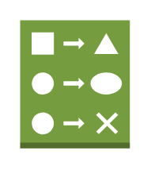

# Change Set

## Definition

```
{
  _style: 'outlineConnect=0;dashed=0;verticalLabelPosition=bottom;verticalAlign=top;align=center;html=1;shape=mxgraph.aws3.change_set;fillColor=#759C3E;gradientColor=none;',
  _width: 55.5,
  _height: 64.5,
}
```

## Usage

```
import { ChangeSet } from '@diac/standard-components-diagrams/aws17ManagementTools'

<ChangeSet/>
```

## Preview


