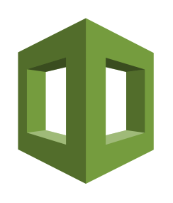
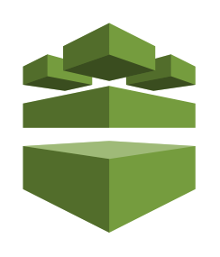
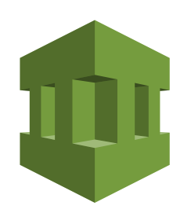

# Aws17 Management Tools Entities

- [Alarm](./alarm.md)  

- [Apps](./apps.md)  

- [Automation](./automation.md)  

- [ChangeSet](./change-set.md)  

- [Checklist](./checklist.md)  

- [ChecklistCost](./checklist-cost.md)  

- [ChecklistFaultTolerance](./checklist-fault-tolerance.md)  

- [ChecklistPerformance](./checklist-performance.md)  

- [ChecklistSecurity](./checklist-security.md)  

- [Cloudformation](./cloudformation.md)  

- [Cloudtrail](./cloudtrail.md)  

- [Cloudwatch](./cloudwatch.md)  

- [Config](./config.md)  

- [ConfigRule](./config-rule.md)  

- [Deployments](./deployments.md)  

- [Documents](./documents.md)  

- [Ec2SystemsManager](./ec2-systems-manager.md)  

- [EventEventBased](./event-event-based.md)  

- [EventTimeBased](./event-time-based.md)  

- [Instances](./instances.md)  

- [Inventory](./inventory.md)  

- [Layers](./layers.md)  

- [MaintenanceWindow](./maintenance-window.md)  

- [ManagedServices](./managed-services.md)  

- [Monitoring](./monitoring.md)  

- [Opsworks](./opsworks.md)  

- [ParameterStore](./parameter-store.md)  

- [PatchManager](./patch-manager.md)  

- [Permissions](./permissions.md)  

- [Resources](./resources.md)  

- [RunCommand](./run-command.md)  

- [ServiceCatalog](./service-catalog.md)  

- [StackAwsCloudformation](./stack-aws-cloudformation.md)  

- [StackAwsOpsworks](./stack-aws-opsworks.md)  

- [StateManager](./state-manager.md)  

- [Template](./template.md)  

- [TrustedAdvisor](./trusted-advisor.md)  

