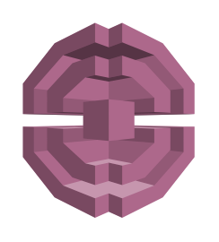

# Pinpoint

## Definition

```
{
  _style: 'outlineConnect=0;dashed=0;verticalLabelPosition=bottom;verticalAlign=top;align=center;html=1;shape=mxgraph.aws3.pinpoint;fillColor=#AD688B;gradientColor=none;',
  _width: 76.5,
  _height: 87,
}
```

## Usage

```
import { Pinpoint } from '@reactiac/standard-components-diagrams/aws17Messaging'

<Pinpoint/>
```

## Preview


