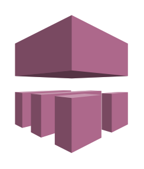

# Device Farm

## Definition

```
{
  _style: 'outlineConnect=0;dashed=0;verticalLabelPosition=bottom;verticalAlign=top;align=center;html=1;shape=mxgraph.aws3.device_farm;fillColor=#AD688B;gradientColor=none;',
  _width: 76.5,
  _height: 93,
}
```

## Usage

```
import { DeviceFarm } from '@reactiac/standard-components-diagrams/aws17MobileServices'

<DeviceFarm/>
```

## Preview


