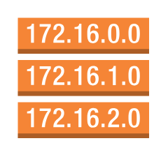

# Route Table

## Definition

```
{
  _style: { 
    entity: 'outlineConnect=0;dashed=0;verticalLabelPosition=bottom;verticalAlign=top;align=center;html=1;shape=mxgraph.aws3.route_table;fillColor=#F58536;gradientColor=none;',
  },
  _original_width: 75,
  _original_height: 69,
}
```

## Usage

```
import { RouteTable } from '@dinghy/standard-components-diagrams/aws17NetworkAndContentDelivery'

<RouteTable/>
```

## Preview


