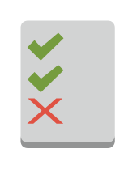

# Permissions

## Definition

```
{
  _style: { 
    entity: 'outlineConnect=0;dashed=0;verticalLabelPosition=bottom;verticalAlign=top;align=center;html=1;shape=mxgraph.aws3.permissions_2;fillColor=#D2D3D3;gradientColor=none;',
  },
  _original_width: 46.5,
  _original_height: 63,
}
```

## Usage

```
import { Permissions } from '@diac/standard-components-diagrams/aws17SecurityIdentityAndCompliance'

<Permissions/>
```

## Preview


