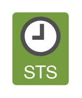

# STS 2

## Definition

```
{
  _style: 'outlineConnect=0;dashed=0;verticalLabelPosition=bottom;verticalAlign=top;align=center;html=1;shape=mxgraph.aws3.sts_2;fillColor=#759C3E;gradientColor=none;',
  _width: 46.5,
  _height: 60,
}
```

## Usage

```
import { Sts2 } from '@reactiac/standard-components-diagrams/aws17SecurityIdentityAndCompliance'

<Sts2/>
```

## Preview


