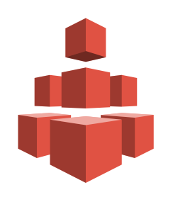
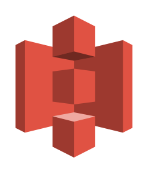
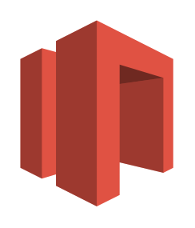

# Aws17 Storage Entities

- [Archive](./archive.md)  

- [Bucket](./bucket.md)  

- [BucketWithObjects](./bucket-with-objects.md)  

- [CachedVolume](./cached-volume.md)  

- [Efs](./efs.md)  

- [EfsShare](./efs-share.md)  

- [Glacier](./glacier.md)  

- [ImportExport](./import-export.md)  

- [NonCachedVolume](./non-cached-volume.md)  

- [Object](./object.md)  

- [S3](./s3.md)  

- [Snapshot](./snapshot.md)  

- [Snowball](./snowball.md)  

- [StorageGateway](./storage-gateway.md)  

- [Vault](./vault.md)  

- [VirtualTapeLibrary](./virtual-tape-library.md)  

- [Volume](./volume.md)  

