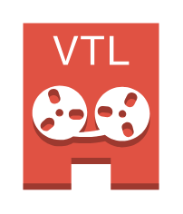

# Virtual Tape Library

## Definition

```
{
  _style: { 
    entity: 'outlineConnect=0;dashed=0;verticalLabelPosition=bottom;verticalAlign=top;align=center;html=1;shape=mxgraph.aws3.virtual_tape_library;fillColor=#E05243;gradientColor=none;',
  },
  _width: 60,
  _height: 73.5,
}
```

## Usage

```
import { VirtualTapeLibrary } from '@diac/standard-components-diagrams/aws17Storage'

<VirtualTapeLibrary/>
```

## Preview


