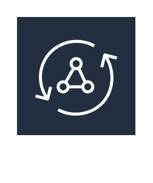

# Aws18 Application Integration Entities

- [AmazonMq](./amazon-mq.md)  

- [AmazonSns](./amazon-sns.md)  

- [AmazonSqs](./amazon-sqs.md)  

- [AwsAppsync](./aws-appsync.md)  

- [AwsStepFunctions](./aws-step-functions.md)  

- [EmailNotification](./email-notification.md)  

- [HttpNotification](./http-notification.md)  

- [Message](./message.md)  

- [Queue](./queue.md)  

- [Topic](./topic.md)  

