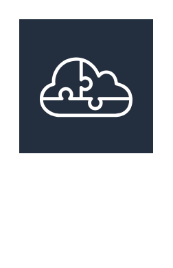

# AWS Serverless Application Repository

## Definition

```
{
  _style: 'sketch=0;outlineConnect=0;fontColor=#232F3E;gradientColor=none;strokeColor=#ffffff;fillColor=#232F3E;dashed=0;verticalLabelPosition=middle;verticalAlign=bottom;align=center;html=1;whiteSpace=wrap;fontSize=10;fontStyle=1;spacing=3;shape=mxgraph.aws4.productIcon;prIcon=mxgraph.aws4.serverless_application_repository;',
  _width: 80,
  _height: 135,
}
```

## Usage

```
import { AwsServerlessApplicationRepository } from '@reactiac/standard-components-diagrams/aws18Compute'

<AwsServerlessApplicationRepository/>
```

## Preview


