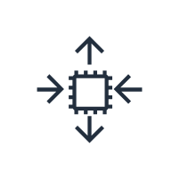
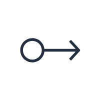

# Aws18 Compute Entities

- [AmazonEc2](./amazon-ec2.md)  

- [AmazonEcr](./amazon-ecr.md)  

- [AmazonEcs](./amazon-ecs.md)  

- [AmazonEks](./amazon-eks.md)  

- [AmazonLightsail](./amazon-lightsail.md)  

- [Ami](./ami.md)  

- [Application](./application.md)  

- [ApplicationLoadBalancer](./application-load-balancer.md)  

- [AutoScaling](./auto-scaling.md)  

- [AwsBatch](./aws-batch.md)  

- [AwsElasticBeanstalk](./aws-elastic-beanstalk.md)  

- [AwsFargate](./aws-fargate.md)  

- [AwsLambda](./aws-lambda.md)  

- [AwsServerlessApplicationRepository](./aws-serverless-application-repository.md)  

- [ClassicLoadBalancer](./classic-load-balancer.md)  

- [Container1](./container-1.md)  

- [Container2](./container-2.md)  

- [Container3](./container-3.md)  

- [DbOnInstance](./db-on-instance.md)  

- [Deployment](./deployment.md)  

- [ElasticIpAddress](./elastic-ip-address.md)  

- [ElasticLoadBalancing](./elastic-load-balancing.md)  

- [Instance](./instance.md)  

- [InstanceWithCloudwatch](./instance-with-cloudwatch.md)  

- [Instances](./instances.md)  

- [LambdaFunction](./lambda-function.md)  

- [NetworkLoadBalancer](./network-load-balancer.md)  

- [OptimizedInstance](./optimized-instance.md)  

- [Registry](./registry.md)  

- [Rescue](./rescue.md)  

- [SpotInstance](./spot-instance.md)  

- [VmwareCloudOnAws](./vmware-cloud-on-aws.md)  

- [X1Instance](./x1-instance.md)  

