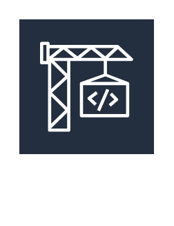
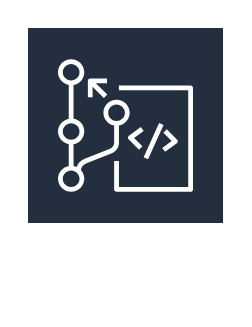
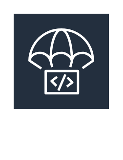
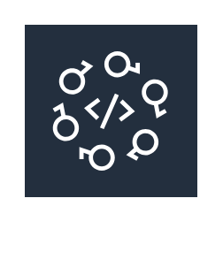

# Aws18 Developer Tools Entities

- [AwsCommandLineInterface](./aws-command-line-interface.md)  

- [AwsCloud9](./aws-cloud9.md)  

- [AwsCodebuild](./aws-codebuild.md)  

- [AwsCodecommit](./aws-codecommit.md)  

- [AwsCodedeploy](./aws-codedeploy.md)  

- [AwsCodepipeline](./aws-codepipeline.md)  

- [AwsCodestar](./aws-codestar.md)  

- [AwsToolsAndSdks](./aws-tools-and-sdks.md)  

- [AwsXRay](./aws-x-ray.md)  

