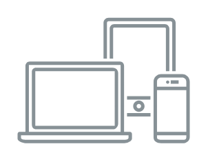

# devices

## Definition

```
{
  _style: { 
    entity: 'sketch=0;outlineConnect=0;gradientColor=none;fontColor=#545B64;strokeColor=none;fillColor=#879196;dashed=0;verticalLabelPosition=bottom;verticalAlign=top;align=center;html=1;fontSize=12;fontStyle=0;aspect=fixed;shape=mxgraph.aws4.illustration_devices;pointerEvents=1',
  },
  _width: 100,
  _height: 73,
}
```

## Usage

```
import { Devices } from '@diac/standard-components-diagrams/aws18Illustrations'

<Devices/>
```

## Preview


