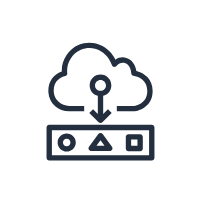
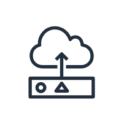

# Aws18 IoT Resources Entities

- [Action](./action.md)  

- [Actuator](./actuator.md)  

- [AlexaEnabledDevice](./alexa-enabled-device.md)  

- [AlexaSkill](./alexa-skill.md)  

- [AlexaSmartHomeSkill](./alexa-smart-home-skill.md)  

- [AlexaVoiceService](./alexa-voice-service.md)  

- [CertificateManager](./certificate-manager.md)  

- [DesiredState](./desired-state.md)  

- [Echo](./echo.md)  

- [Firetv](./firetv.md)  

- [FiretvStick](./firetv-stick.md)  

- [HardwareBoard](./hardware-board.md)  

- [HttpProtocol](./http-protocol.md)  

- [Http2Protocol](./http-2-protocol.md)  

- [LambdaFunction](./lambda-function.md)  

- [MqttProtocol](./mqtt-protocol.md)  

- [Policy](./policy.md)  

- [ReportedState](./reported-state.md)  

- [Rule](./rule.md)  

- [Sensor](./sensor.md)  

- [Servo](./servo.md)  

- [Shadow](./shadow.md)  

- [Simulator](./simulator.md)  

- [Topic](./topic.md)  

