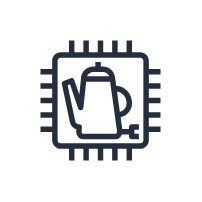

# Coffee Pot

## Definition

```
{
  _style: 'sketch=0;outlineConnect=0;fontColor=#232F3E;gradientColor=none;strokeColor=#232F3E;fillColor=#ffffff;dashed=0;verticalLabelPosition=bottom;verticalAlign=top;align=center;html=1;fontSize=12;fontStyle=0;aspect=fixed;shape=mxgraph.aws4.resourceIcon;resIcon=mxgraph.aws4.coffee_pot;',
  _width: 60,
  _height: 60,
}
```

## Usage

```
import { CoffeePot } from '@reactiac/standard-components-diagrams/aws18IotThings'

<CoffeePot/>
```

## Preview


