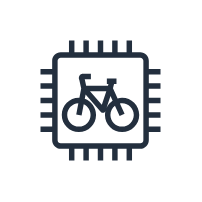
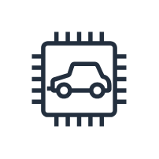
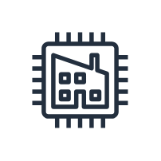
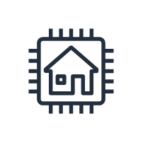
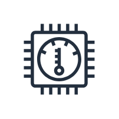
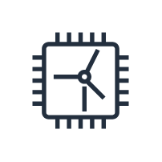

# Aws18 IoT Things Entities

- [Bank](./bank.md)  

- [Bycicle](./bycicle.md)  

- [Camera](./camera.md)  

- [Car](./car.md)  

- [Cart](./cart.md)  

- [CoffeePot](./coffee-pot.md)  

- [DoorLock](./door-lock.md)  

- [Factory](./factory.md)  

- [Generic](./generic.md)  

- [House](./house.md)  

- [Lightbulb](./lightbulb.md)  

- [MedicalEmergency](./medical-emergency.md)  

- [PoliceEmergency](./police-emergency.md)  

- [Thermostat](./thermostat.md)  

- [Travel](./travel.md)  

- [Utility](./utility.md)  

- [Windfarm](./windfarm.md)  

