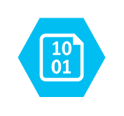

# Storage Blob

## Definition

```
{
  _style: 'verticalLabelPosition=bottom;html=1;verticalAlign=top;align=center;strokeColor=none;fillColor=#00BEF2;shape=mxgraph.azure.storage_blob;',
  _width: 50,
  _height: 45,
}
```

## Usage

```
import { StorageBlob } from '@diac/standard-components-diagrams/azure'

<StorageBlob/>
```

## Preview


