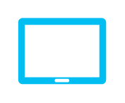

# Tablet

## Definition

```
{
  _style: { 
    entity: 'verticalLabelPosition=bottom;html=1;verticalAlign=top;align=center;strokeColor=none;fillColor=#00BEF2;shape=mxgraph.azure.tablet;pointerEvents=1;',
  },
  _original_width: 50,
  _original_height: 37.5,
}
```

## Usage

```
import { Tablet } from '@diac/standard-components-diagrams/azure'

<Tablet/>
```

## Preview


