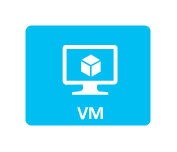

# Virtual Machine

## Definition

```
{
  _style: { 
    entity: 'verticalLabelPosition=bottom;html=1;verticalAlign=top;align=center;strokeColor=none;fillColor=#00BEF2;shape=mxgraph.azure.virtual_machine;',
  },
  _original_width: 50,
  _original_height: 40,
}
```

## Usage

```
import { VirtualMachine } from '@dinghy/standard-components-diagrams/azure'

<VirtualMachine/>
```

## Preview


