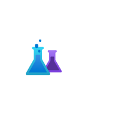

# Experimentation Studio

## Definition

```
{
  _style: { 
    entity: 'image;aspect=fixed;html=1;points=[];align=center;fontSize=12;image=img/lib/azure2/ai_machine_learning/Azure_Experimentation_Studio.svg;strokeColor=none;',
  },
  _original_width: 68,
  _original_height: 56.00000000000001,
}
```

## Usage

```
import { ExperimentationStudio } from '@dinghy/standard-components-diagrams/azure2AiAndMachineLearning'

<ExperimentationStudio/>
```

## Preview


