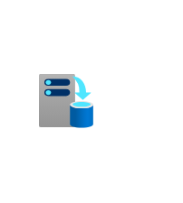

# Azure2 Azure2 Stack Entities

- [Capacity](./capacity.md)  

- [InfrastructureBackup](./infrastructure-backup.md)  

- [MultiTenancy](./multi-tenancy.md)  

- [Offers](./offers.md)  

- [Plans](./plans.md)  

- [Stack](./stack.md)  

- [Updates](./updates.md)  

- [UserSubscriptions](./user-subscriptions.md)  

