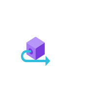

# Outbound Connection

## Definition

```
{
  _style: 'image;aspect=fixed;html=1;points=[];align=center;fontSize=12;image=img/lib/azure2/blockchain/Outbound_Connection.svg;strokeColor=none;',
  _width: 71,
  _height: 64,
}
```

## Usage

```
import { OutboundConnection } from '@diac/standard-components-diagrams/azure2Blockchain'

<OutboundConnection/>
```

## Preview


