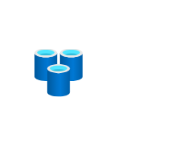

# Cache Redis

## Definition

```
{
  _style: { 
    entity: 'image;aspect=fixed;html=1;points=[];align=center;fontSize=12;image=img/lib/azure2/databases/Cache_Redis.svg;strokeColor=none;',
  },
  _original_width: 64,
  _original_height: 52,
}
```

## Usage

```
import { CacheRedis } from '@dinghy/standard-components-diagrams/azure2Databases'

<CacheRedis/>
```

## Preview


