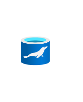
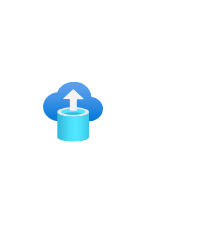
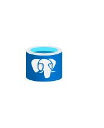
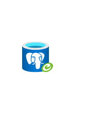
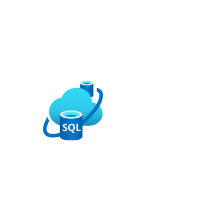

# Azure2 Databases Entities

- [CacheRedis](./cache-redis.md)  

- [CosmosDb](./cosmos-db.md)  

- [DataExplorerClusters](./data-explorer-clusters.md)  

- [DataFactory](./data-factory.md)  

- [DatabaseMariadbServer](./database-mariadb-server.md)  

- [DatabaseMigrationServices](./database-migration-services.md)  

- [DatabaseMysqlServer](./database-mysql-server.md)  

- [DatabasePostgresqlServer](./database-postgresql-server.md)  

- [DatabasePostgresqlServerGroup](./database-postgresql-server-group.md)  

- [ElasticJobAgents](./elastic-job-agents.md)  

- [InstancePools](./instance-pools.md)  

- [ManagedDatabase](./managed-database.md)  

- [OracleDatabase](./oracle-database.md)  

- [PurviewAccounts](./purview-accounts.md)  

- [Sql](./sql.md)  

- [SqlDataWarehouses](./sql-data-warehouses.md)  

- [SqlDatabase](./sql-database.md)  

- [SqlEdge](./sql-edge.md)  

- [SqlElasticPools](./sql-elastic-pools.md)  

- [SqlManagedInstance](./sql-managed-instance.md)  

- [SqlServer](./sql-server.md)  

- [SqlServerRegistries](./sql-server-registries.md)  

- [SqlServerStretchDatabases](./sql-server-stretch-databases.md)  

- [SqlVm](./sql-vm.md)  

- [SsisLiftAndShiftIr](./ssis-lift-and-shift-ir.md)  

- [SynapseAnalytics](./synapse-analytics.md)  

- [VirtualClusters](./virtual-clusters.md)  

