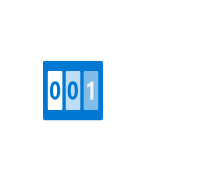

# Counter

## Definition

```
{
  _style: { 
    entity: 'image;aspect=fixed;html=1;points=[];align=center;fontSize=12;image=img/lib/azure2/general/Counter.svg;strokeColor=none;',
  },
  _width: 64,
  _height: 52,
}
```

## Usage

```
import { Counter } from '@diac/standard-components-diagrams/azure2General'

<Counter/>
```

## Preview


